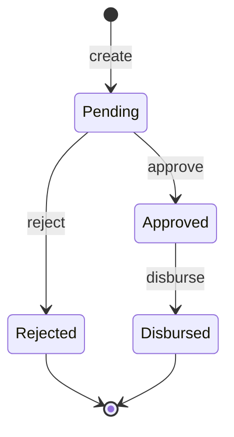

# Loan Disbursement API

[](https://github.com/chander-kumar-dev/loan-disbursement-api/actions/workflows/ci.yml)


A loan lifecycle API built with **ASP.NET Core 10**: create a loan, approve or reject it, and disburse it. Built with **Clean Architecture**, **CQRS**, **EF Core code-first** on **SQL Server**, and **xUnit** tests that run real SQL.

The core rule of any lending system is that money is paid out once, and only after approval. This project enforces that rule in the domain model itself, so no controller, handler or future integration can bypass it.

## Loan lifecycle



Every state change goes through a method on the `Loan` entity, which checks the current status first. Disbursing a pending loan, approving twice, or disbursing the same loan twice returns `409 Conflict`.

## Architecture

```text
src/
  LoanDisbursement.Domain          Loan entity and business rules. No dependencies.
  LoanDisbursement.Application     Commands, queries and their handlers (CQRS).
  LoanDisbursement.Infrastructure  EF Core DbContext, table mapping, migrations, SQL Server.
  LoanDisbursement.Api             Controllers, validation, error handling, startup.
tests/
  LoanDisbursement.Tests           xUnit tests for domain rules and handlers.
```

Dependencies point inward: `Api → Application → Domain`, and `Infrastructure → Application`. The Domain knows nothing about databases or HTTP.

```text
HTTP request → LoansController → handler → Loan (rules) → AppDbContext → SQL Server
```

### CQRS

| Commands (change data) | Queries (read only) |
|---|---|
| `CreateLoanHandler` | `GetLoanByIdHandler` |
| `ApproveLoanHandler` | `GetLoansHandler` |
| `RejectLoanHandler` | |
| `DisburseLoanHandler` | |

Commands load the entity, call a domain method, and save. Queries use `AsNoTracking()` because they never change anything.

## Endpoints

| Method | Route | Description |
|---|---|---|
| `POST` | `/api/loans` | Create a loan (status `Pending`) |
| `GET` | `/api/loans/{id}` | Get one loan |
| `GET` | `/api/loans?status=Approved` | List loans, newest first, optionally filtered by status |
| `POST` | `/api/loans/{id}/approve` | Approve a pending loan |
| `POST` | `/api/loans/{id}/reject` | Reject a pending loan with a reason |
| `POST` | `/api/loans/{id}/disburse` | Disburse an approved loan |
| `GET` | `/health` | Health check |

Errors use RFC 7807 problem details: `400` for invalid input, `404` for an unknown loan, `409` for a business-rule violation.

Validation limits: amount 1 to 5,000,000; tenure 1 to 60 months; applicant name up to 200 characters; account number up to 34 characters (IBAN length).

Example requests are in [`LoanDisbursement.Api.http`](src/LoanDisbursement.Api/LoanDisbursement.Api.http) (VS Code REST Client or Visual Studio).

## Run locally

Requires the **.NET 10 SDK** and **SQL Server** (SQL Server Express, or Docker).

**1. Install the EF Core tool (once)**

```bash
dotnet tool install --global dotnet-ef --version 10.*
```

**2. Point the API at a database**

In the `Development` environment, `appsettings.Development.json` connects to SQL Server Express on Windows:

```text
Server=.\SQLEXPRESS;Database=LoanDisbursement;Trusted_Connection=True;TrustServerCertificate=True;
```

Without SQL Server Express (macOS, Linux, or Windows), start SQL Server in Docker and override the connection string:

```bash
docker compose up -d
```

```bash
# bash / zsh
export ConnectionStrings__LoanDb="Server=localhost,1433;Database=LoanDisbursement;User Id=sa;Password=Dev_Password_123!;TrustServerCertificate=True"
```

```powershell
# PowerShell
$env:ConnectionStrings__LoanDb = "Server=localhost,1433;Database=LoanDisbursement;User Id=sa;Password=Dev_Password_123!;TrustServerCertificate=True"
```

The Docker password is for local development only.

**3. Create the database**

The `InitialCreate` migration is already in the repository, so you only need to apply it:

```bash
dotnet ef database update --project src/LoanDisbursement.Infrastructure --startup-project src/LoanDisbursement.Api
```

**4. Run the API**

```bash
dotnet run --project src/LoanDisbursement.Api --launch-profile https
```

Open `https://localhost:7080/swagger` (or `http://localhost:5080/swagger`). Swagger UI and the `/routes` endpoint map are enabled only in `Development`.

Outside `Development`, no connection string is bundled; the API fails fast at startup until `ConnectionStrings__LoanDb` is supplied.

## Tests

```bash
dotnet test
```

- **Domain tests** cover every status transition and validation rule, including that a loan can never be disbursed twice.
- **Handler tests** run against an in-memory **SQLite** database, so they execute real SQL. Each step uses a fresh `DbContext`, which proves data was actually persisted rather than cached by EF Core.

CI runs restore, build and test on every push and pull request via GitHub Actions.

## Design decisions

- **Business rules live in the entity.** `Loan` has private setters and state-change methods, so an invalid transition cannot be expressed anywhere else in the codebase.
- **No mediator library.** Controllers receive the handler they need directly through `[FromServices]`. The flow is easy to follow, with one less dependency.
- **`IAppDbContext` instead of repositories.** Handlers use EF Core through an interface, avoiding a repository layer that would only forward calls.
- **SQLite instead of the EF Core InMemory provider for tests.** InMemory is not relational and hides problems such as constraint violations.
- **`TimeProvider` for the current time.** Tests use a fixed clock, so timestamps are deterministic.
- **Status stored as text.** The `Loans` table shows `Approved` instead of `1`, which is easier to read when investigating production data.
- **Central Package Management.** Every NuGet version lives in [`Directory.Packages.props`](Directory.Packages.props) as an exact version. Builds are reproducible, and Dependabot proposes each upgrade as a reviewable pull request.

## Production readiness: known gaps

This is a reference implementation of the lifecycle and its rules. A real lending platform needs the following before going live; they are listed here deliberately rather than hidden.

| Gap | Risk in production | Planned approach |
|---|---|---|
| No idempotency key on disburse | A client retry after a timeout could trigger a second payout request to the core banking system | `Idempotency-Key` header stored with a unique index; replay returns the original response |
| No optimistic concurrency | Two simultaneous disburse requests can both read `Approved` | `rowversion` concurrency token; the loser receives `409` |
| Disbursement is a status change only | No real funds movement or reconciliation | Core banking adapter with timeouts, retries and circuit breaker; transactional outbox; daily reconciliation job |
| No authentication or maker-checker | Anyone can approve, including the loan's creator | JWT auth, role-based policies, and a rule that approver ≠ creator |
| Account number returned in full | PII exposure in responses and logs | Mask in DTOs (`****6702`), encrypt at rest |
| No audit trail | Cannot answer "who changed what, when" for regulators | Append-only status history table or domain events |

## Roadmap

- [ ] Simulated core banking integration with timeouts, retries and an outbox
- [ ] Idempotency keys on disbursement
- [ ] Optimistic concurrency on the `Loans` table
- [ ] API integration tests with `WebApplicationFactory` and Testcontainers
- [ ] Authentication, role-based approval, maker-checker
- [ ] Structured logging and OpenTelemetry tracing

## License

[MIT](LICENSE)
